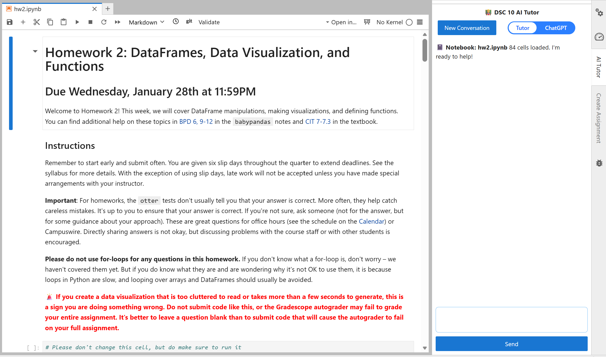
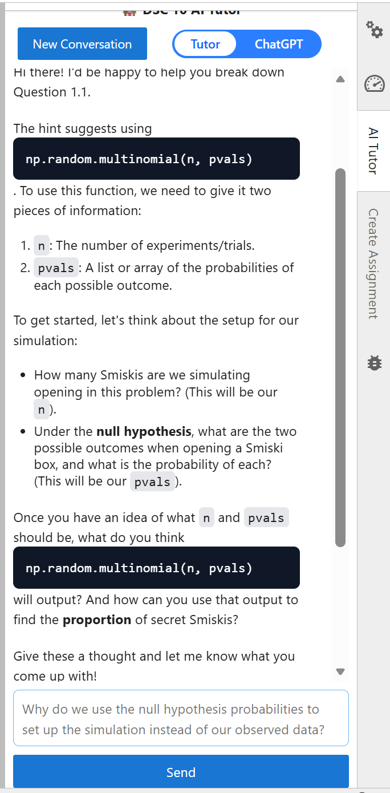
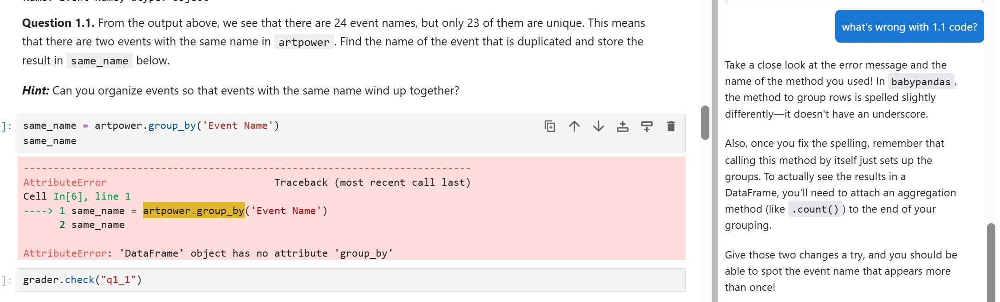

# AI Tutor

## What is the AI Tutor?

In DSC 10, you'll have access to an artificial intelligence tutoring tool (AI Tutor) directly within your assignments. The interface will appear on the right side of the screen whenever you start working on DSC 10 assignments, making it easy to ask questions and get help in the same place you write your code. The goal of the AI Tutor is to support your learning and like any resource in this course, it works best when used thoughtfully.

The AI tutor has two main modes:

### Tutor Mode

This mode is designed to guide your learning. Instead of giving you direct answers, it helps you think through problems, understand concepts, and build intuition step by step.

### ChatGPT Mode

This mode is more direct and flexible. It can provide explanations, examples, and code suggestions more freely, similar to general-purpose AI tools.

The key difference is how much help you get and how it's delivered.

- **Tutor Mode** focuses on learning. It may ask you questions, give hints, or break problems into smaller steps.
- **ChatGPT Mode** focuses on efficiency. It may provide more complete answers or code more quickly.

Both modes are useful but they serve different purposes.

## When should I use each mode?

There isn't a single "right" mode. It all depends on your goals.

Some general guidance:

- **Use Tutor Mode when:**
  - You get stuck on a question in an assignment
  - You want to understand how to solve similar questions on quizzes and exams
  - You want guided practice rather than answers
- **Use ChatGPT Mode when:**
  - You want to see an example or alternative approach
  - You're exploring topics beyond what we covered in class

In general, we recommend Tutor Mode when you're working on a particular question in assignment, because it will support your learning by pointing out errors and suggesting possible next steps, but it will not do your work for you. We hope that students who use Tutor Mode will develop a deeper understanding of course material than students who use ChatGPT Mode and students who avoid the AI Tutor altogether. 

Ultimately, you are responsible for your own learning. Choose the mode that best supports your understanding!

## What can the AI Tutor do?

In both modes, the AI tutor:

- Has access to your current assignment and code
- Is familiar with babypandas and DSC 10 course materials 
- Can help explain concepts, debug code, and guide your approach

Additional to this, the tutor mode can also retrieve lecture or exam practice problems for quick access.

The AI Tutor is a new resource for this class, and it is a work in progress. Occasionally, it may suggest code or ideas that go beyond what is covered in DSC 10. If that happens, please let us know!

## Data and Privacy

Your privacy is important to us.

- Your interactions with the AI tutor will be logged in a separate, private database.
- DSC 10 course staff will not have access to this data.
- Your usage of the AI tutor will not affect your grade in any way.
- Data is only accessible to a separate research team, led by Professor Sam Lau.
- The data is used to improve the tool and better understand how students learn.

## Experimental Features

The AI Tutor is an evolving tool. As we continue to improve it, you may notice features appearing, changing, or disappearing over time. We are actively experimenting to make the tutor more helpful for your learning.

## Opting Out

Participation in data collection is completely optional. You may opt out at any time. If you choose to opt out, please fill out the [opt-out form](https://docs.google.com/forms/d/e/1FAIpQLScOp3RjauMojvslcLmH87tF6O0RSx9vTXtkYpxv8LQWq6bwQA/viewform) and your future interactions with the AI Tutor will not be included in the research dataset.

## Final Note

The AI Tutor is a powerful resource and we hope you will give it a try! Of course, AI tools are never a substitute for your own understanding.

Use the AI Tutor to:

- Clarify concepts
- Explore ideas
- Get unstuck

Your goal in DSC 10 is to learn the material and build your own skills. The best way to succeed in this course and beyond is to actively engage with the material and think through problems yourself before using tools like the AI Tutor.
